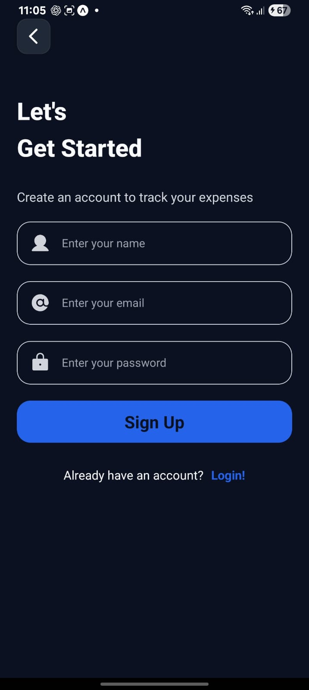
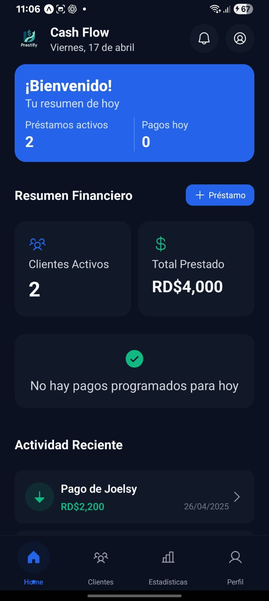
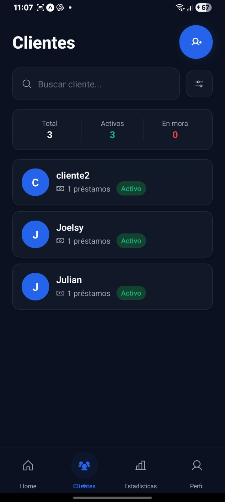
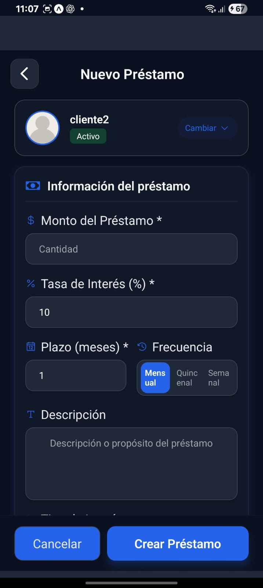

# Prestify

Prestify es una aplicación móvil de gestión de préstamos orientada a prestamistas. Su objetivo principal es centralizar la información de clientes, préstamos, pagos y resúmenes financieros en una interfaz moderna, facilitando el control del negocio, el seguimiento de cobros y la reducción de errores manuales.

## Objetivo general

Desarrollar una aplicación móvil que permita a prestamistas gestionar de forma eficiente sus clientes, préstamos y cobros, mostrando además información relevante del negocio mediante un dashboard interactivo.

Con esto se busca:

- Centralizar la información de préstamos
- Mejorar el control de pagos
- Reducir errores manuales
- Ofrecer una experiencia moderna y sencilla

## Características principales

### Autenticación
- Registro de usuarios
- Inicio de sesión
- Validación de credenciales
- Manejo de sesión

### Dashboard
- Resumen financiero
- Clientes activos
- Próximos cobros
- Indicadores básicos

### Clientes
- Crear clientes
- Listar clientes
- Visualizar información básica de cada cliente

### Préstamos
- Crear préstamos
- Asociar préstamos a clientes
- Definir monto, interés, fechas y estado
- Visualizar el estado del préstamo

### Reportes básicos
- Listado de préstamos
- Vista general de ingresos

## Tecnologías utilizadas

- **Frontend:** React Native con Expo y TypeScript
- **UI / Estilos:** Tamagui, Moti, estilos tipo Tailwind
- **Navegación:** Expo Router
- **Autenticación:** Firebase Authentication
- **Capa de datos / Backend actual:** Firebase
- **Control de versiones:** Git y GitHub
- **Metodología:** Agile Scrum

## Alcance del proyecto

Este repositorio contiene la base del MVP de Prestify, enfocada en el primer release funcional. El alcance actual incluye:

- Flujo de autenticación
- Dashboard inicial
- Estructura base de navegación
- Componentes reutilizables de UI
- Manejo básico de perfil
- Integración inicial con Firebase
- Módulo de clientes
- Módulo de préstamos
- Flujos importantes mediante modales

## Mejoras futuras previstas

- Notificaciones de cobro
- Automatización de pagos
- Reportes avanzados
- Modo SaaS multiusuario
- Integración con pagos digitales

## Estructura general del proyecto

```text
app/
  (auth)/
  (dashboard)/
  (modals)/
  (client)/
components/
hooks/
services/
utils/
```

## Configuración importante

### 1. Instalación de dependencias

```bash
npm install
```

### 2. Ejecución del proyecto

```bash
npx expo start
```

### 3. Configuración de Firebase
Este proyecto utiliza Firebase para autenticación y acceso a datos. Antes de ejecutar la aplicación, asegúrate de que la configuración de Firebase esté correctamente definida y que las credenciales del proyecto sean válidas.

### 4. Sistema de rutas
La navegación está construida con **Expo Router**, por lo que la estructura de rutas depende directamente del directorio `app/`.

### 5. Entorno recomendado
- Node.js LTS
- npm
- Expo CLI / Expo Go
- Emulador Android o dispositivo físico
- Visual Studio Code

## Instalación rápida

```bash
git clone https://github.com/nilfredb/Prestify.git
cd expense-tracker-app
npm install
npx expo start
```

## Capturas del sistema

### Pantalla de inicio


### Pantalla de registro


### Dashboard principal


### Módulo de clientes


### Módulo de préstamos


## Descripción de módulos principales

### Módulo de autenticación
Gestiona el acceso a la aplicación mediante los flujos de registro e inicio de sesión.

### Módulo de dashboard
Muestra información resumida del negocio, como clientes activos, préstamos activos e indicadores financieros.

### Módulo de clientes
Permite crear, listar y visualizar información básica de los clientes registrados.

### Módulo de préstamos
Permite registrar préstamos, asociarlos a clientes y dar seguimiento a su estado.

### Flujos mediante modales
Acciones importantes como crear clientes o préstamos se gestionan mediante modales para mantener una experiencia más limpia y directa.

## Estrategia de ramas

El proyecto sigue una estrategia de ramas para organizar el desarrollo:

- `main`: versión estable
- `develop`: rama de integración
- `feature/*`: nuevas funcionalidades
- `fix/*`: correcciones de errores
- `release/*`: preparación de versiones
- `test/*`: trabajo relacionado con pruebas

## Límites actuales del MVP

La versión actual **no incluye**:

- Procesamiento de pagos en línea
- Integración bancaria directa
- Soporte multiempresa completo
- Seguridad avanzada de nivel empresarial

## Flujo de contribución

1. Crear una rama a partir de `develop`
2. Implementar los cambios
3. Abrir un Pull Request hacia `develop`
4. Validar los cambios antes de moverlos a una rama de release

## Notas

Este README está pensado para la rama `main`, por lo que se enfoca en la descripción general del proyecto, sus módulos principales y la configuración esencial. Los detalles internos de pruebas, QA o flujos de testing pueden mantenerse en documentación aparte.

